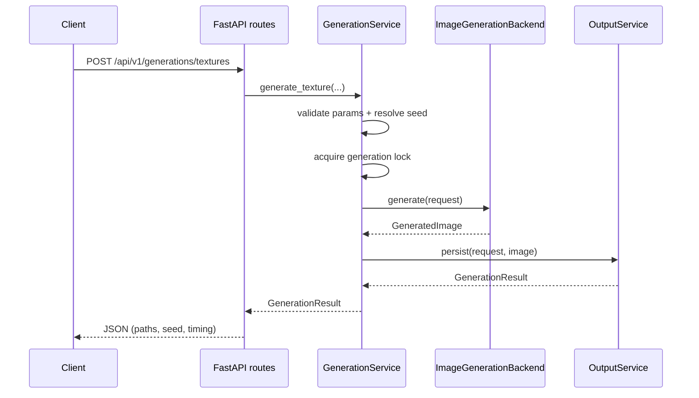
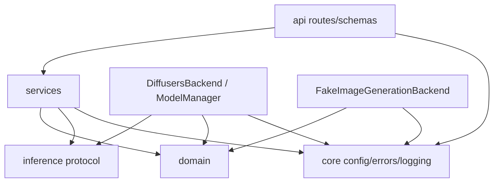

# Architecture

## Overview

The application is a local FastAPI service that generates a single PNG texture from a text prompt, writes reproducibility metadata, and exposes health/generation HTTP endpoints. Inference is behind an explicit backend protocol so Diffusers can be replaced later without changing the API or domain layers.

**ComfyUI is not used** in any form (no workflows, APIs, or nodes).

## Component responsibilities

| Layer | Responsibility |
|-------|----------------|
| `api/` | HTTP transport, Pydantic request/response schemas, status-code mapping |
| `domain/` | Framework-agnostic dataclasses (`GenerationRequest`, `GeneratedImage`, …) |
| `services/generation_service.py` | Validation, seed assignment, orchestration, generation lock |
| `services/output_service.py` | Directory creation, atomic PNG/JSON writes, output-name sanitization |
| `inference/backend.py` | `ImageGenerationBackend` protocol |
| `inference/diffusers_backend.py` | Diffusers implementation of the protocol |
| `inference/fake_backend.py` | Deterministic in-memory backend for tests |
| `inference/model_manager.py` | Device/dtype resolution, lazy load, reuse, load locking |
| `core/config.py` | Environment-backed settings |
| `core/errors.py` | Typed application exceptions |
| `core/logging.py` | Structured console logging |

## Request flow



## Dependency direction



- API depends on services, not on Diffusers types.
- `GenerationService` depends on `ImageGenerationBackend`, not `StableDiffusionPipeline`.
- Domain models do not import FastAPI or Diffusers (Pillow `Image` is used as the portable bitmap type).

## Reasoning behind the inference abstraction

Diffusers APIs, pipelines, and memory helpers evolve quickly. Game tooling may later swap to another local engine. By depending on:

```python
class ImageGenerationBackend(Protocol):
    def generate(self, request: GenerationRequest) -> GeneratedImage: ...
```

the orchestration and HTTP layers stay stable. Tests inject `FakeImageGenerationBackend` via `create_app(..., backend=...)` instead of mocking internal Diffusers calls.

## Model lifecycle

1. `ModelManager` resolves `DEVICE` (`auto` → cuda → mps → cpu).
2. Dtype: CUDA/`auto` → float16; CPU/`auto` → float32; explicit values validated.
3. First `generate` call loads `StableDiffusionPipeline.from_pretrained` under a lock.
4. Pipeline is reused for subsequent requests (no per-request reload).
5. Optional `enable_model_cpu_offload` for low VRAM.
6. Inference runs under `torch.inference_mode()`.
7. Remote code execution from model repos is **not** enabled.

`GET /health` reports `model_loaded` and the backend’s device name without forcing a load.

## Output directory format

```text
generated/
  <generation-uuid>/
    <sanitized_output_name>.png
    <sanitized_output_name>.json
```

- Generation directories are created with `exist_ok=False` (never overwrite).
- Output names are sanitized (no path separators / traversal).
- PNG and JSON are written via temp files + `os.replace` where practical.
- Metadata includes generation id, UTC timestamp, model id/revision, prompts, seed, size, steps, guidance, device, dtype, app version, elapsed time, and filename.

## Concurrency

- An in-process `threading.Lock` serializes generation in `GenerationService`.
- The API handler uses `asyncio.to_thread` so the event loop is not blocked for the entire diffusion call, but the underlying work remains synchronous and single-flight.
- Documented limitation: run **one Uvicorn worker** (`--workers 1`).

## Testing strategy

| Kind | Location | Backend | Network / GPU |
|------|----------|---------|---------------|
| Unit | `tests/unit/` | Fake | No |
| Integration | `tests/integration/` | Fake via app factory | No |
| Smoke | `scripts/smoke_test.py` | Real Diffusers | Yes (explicit only) |

Coverage includes health, valid generation, invalid/excessive dimensions, missing prompt, random vs explicit seeds, output-name sanitization, metadata creation, backend failure translation, and backend substitution.

## Known limitations

- Single-image texture workflow only
- Single-worker / single-flight GPU use
- No Unity importer yet
- Default SD 1.5 quality/VRAM tradeoffs; model is configurable
- Safety checker disabled for local prototyping control — review outputs yourself
- Reproducibility holds for the same environment, model revision, parameters, and seed; cross-GPU determinism is not guaranteed by PyTorch
