# Architecture

## Overview

Local FastAPI texture generation (Diffusers behind an inference protocol) plus an **editor-only Unity package** that discovers backend capabilities, downloads artifacts by generation ID, verifies integrity, and imports them into `Assets/`.

**ComfyUI is not used** in any form.

Application/package version: **0.12.0** (Milestone 12 — packaging, auth, quotas, GPU validation, and a provider-neutral remote worker contract).

## Backend component responsibilities

| Layer | Responsibility |
|-------|----------------|
| `api/routes` | HTTP transport: health, capabilities, jobs, batches, models, generation, image/manifest retrieval |
| `services/job_service.py` | Job state machine, FIFO queue, worker loop, cancel/retry/restart recovery |
| `services/job_store.py` | Atomic JSON job records on local disk |
| `services/batch_expansion.py` | Deterministic prompt/seed/variation expansion into ordinary jobs |
| `services/batch_service.py` | Batch persist/submit/cancel/retry-failed; state is aggregated from member jobs |
| `services/batch_store.py` | Atomic JSON batch records on local disk |
| `services/model_service.py` | Staged install, validation, hashes, storage, offline, safe deletion |
| `services/quota_service.py` | Process-local request-rate and queue-depth admission (not distributed) |
| `services/runtime_validation.py` | GPU/runtime diagnostics for `/ready` and startup logs |
| `services/remote_worker_http.py` | Provider-neutral HTTP adapter for `WORKER_MODE=remote` |
| `core/auth.py` | Configurable API-key authenticator (constant-time compare) |
| `services/job_executor.py` | Execution-backend protocol; local GPU executor and remote-worker adapter |
| `api/schemas` | Versioned public Pydantic models (capabilities, generation, errors) |
| `domain/generation_policy.py` | **Authoritative** generation limits and validation |
| `domain/capabilities.py` | Capability domain models including processing support |
| `domain/generation_manifest.py` | Manifest domain model + legacy metadata compatibility |
| `domain/generation.py` | Generation request/result dataclasses |
| `services/capability_service.py` | Assemble capability document from policy + inference + processing |
| `services/generation_service.py` | Policy validation, seed, lock, orchestration, post-processing |
| `services/output_service.py` | Atomic PNG + manifest persistence, SHA-256, resolve-by-UUID |
| `processing/*` | Background removal, alpha cleanup, tileable wrap/seam/palette (isolated from diffusion backends) |
| `inference/*` | Backend protocol (`describe_capabilities` + `generate`), Diffusers, fake, inpainting pipeline, model manager |
| `core/version.py` | Central API / schema / application version constants |
| `core/error_codes.py` | Stable application + field issue codes |
| `core/exception_handlers.py` | Translate AppError / Pydantic errors into the public envelope |
| `core/middleware.py` | `X-Request-ID` validation, generation, propagation |
| `core/config.py` | Settings including policy, background-removal, job-queue, model-storage, and offline env vars |

## Unity package components

| Area | Responsibility |
|------|----------------|
| `Editor/Api/` | Typed client, DTOs, SimpleJson, error envelope, endpoints |
| `Editor/Versioning/` | `SchemaVersion`, `ClientCompatibility` |
| `Editor/Capabilities/` | Cache, compatibility checker, preflight validator, state |
| `Editor/Integrity/` | PNG byte-size + SHA-256 verification |
| `Editor/Configuration/` | Project Settings |
| `Editor/Generation/` | Request model/factory, state, `GenerationController` orchestration |
| `Editor/Importing/` | Path utilities, import profiles, `GeneratedAssetImporter`, materials |
| `Editor/Metadata/` | Manifest-aware ScriptableObject + importer |
| `Editor/UI/` | `Tools > AI Asset Generator` window, generation history, batch generation, and model management |
| `Editor/Tileable/` | Offset/wrap, seam analysis/correction, palette reduction, tileable previews |
| `Editor/Models/` | Model catalog controller (list/install/validate/activate/delete) |
| `Editor/Tests/` | Edit Mode tests (capabilities, errors, manifests, integrity, tileable, models) |
| `Editor/AssetTypes/` | Asset type contracts |
| `Editor/Prompting/` | Prompt/negative contracts and deterministic resolution |
| `Editor/Profiles/` | `ProfileCatalog`, generation registry/schema, compatibility, persistence, migration |

## Milestone 4 profile loading and persistence

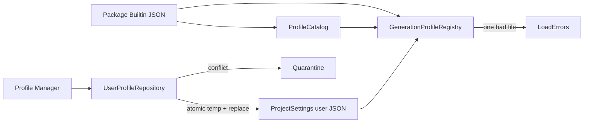

Built-in profiles are immutable. Duplicating assigns a new UUID, revision 1, `builtin=false`,
and `Copy of …`; renaming changes only `display_name`, preserving `<id>.json`.

## Profile resolution and compatibility

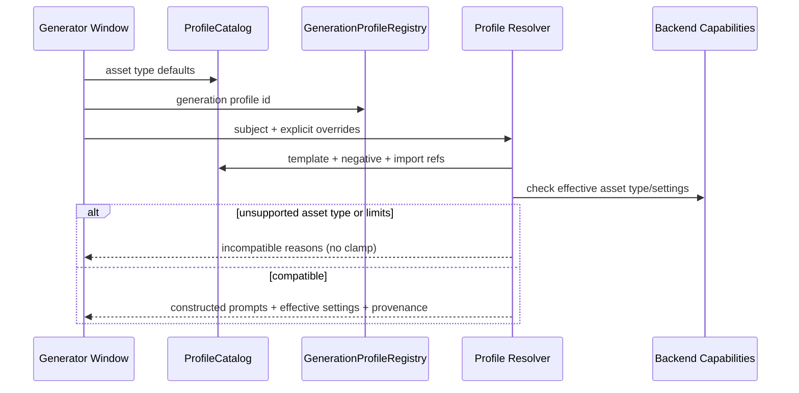

## Generation with profile provenance

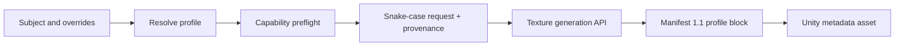

## Migration and built-in versus user flow

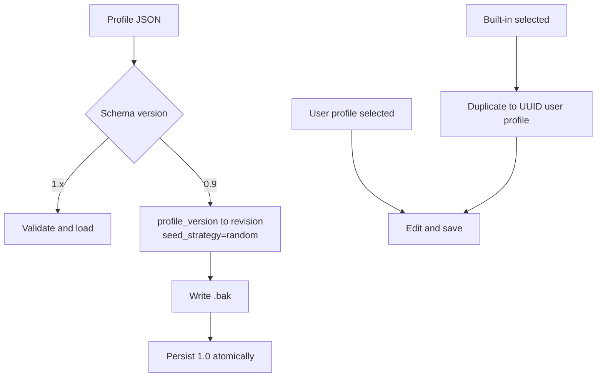

## Dependency direction

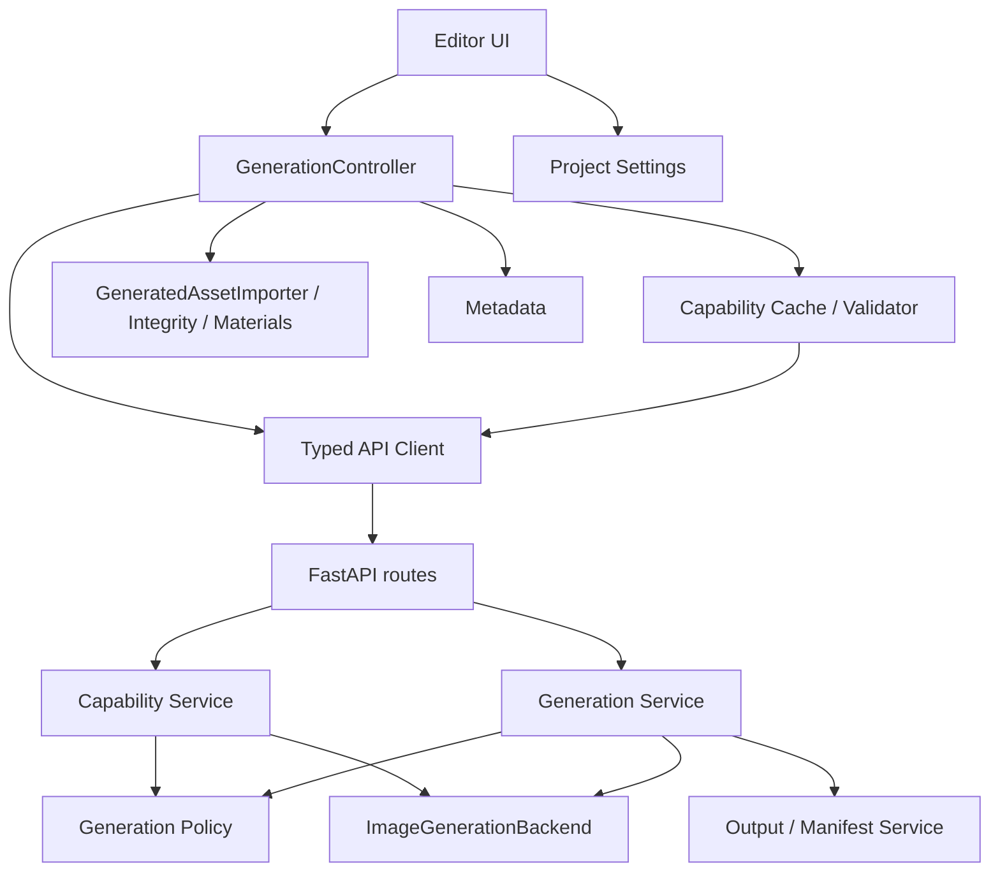

Unity never imports Diffusers types. Public schemas never expose Python class paths or absolute backend filesystem paths as the primary contract.

## Unity capability discovery

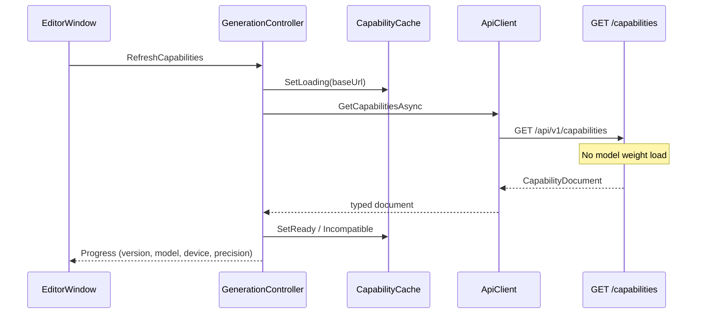

## Local job queue

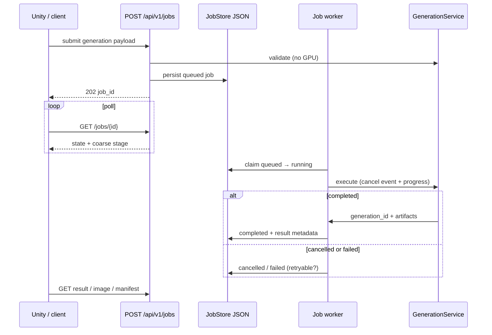

Unity never sees whether the executor is a local GPU or a future remote worker.

## Generation preflight and authoritative validation

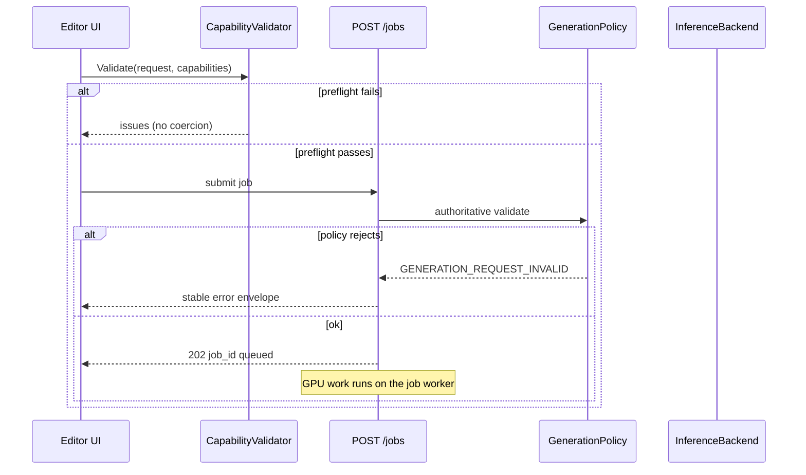

## Error translation and request ID propagation

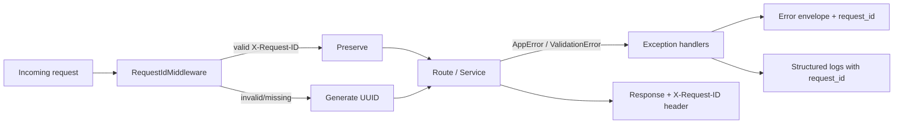

## Generation manifest creation and retrieval

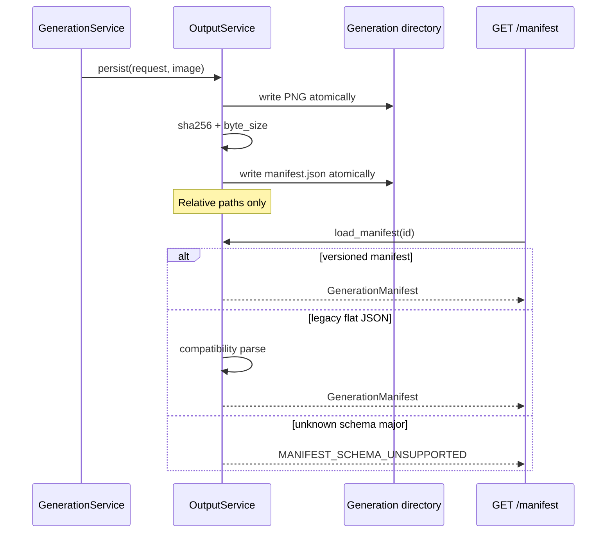

## Unity image download and integrity verification

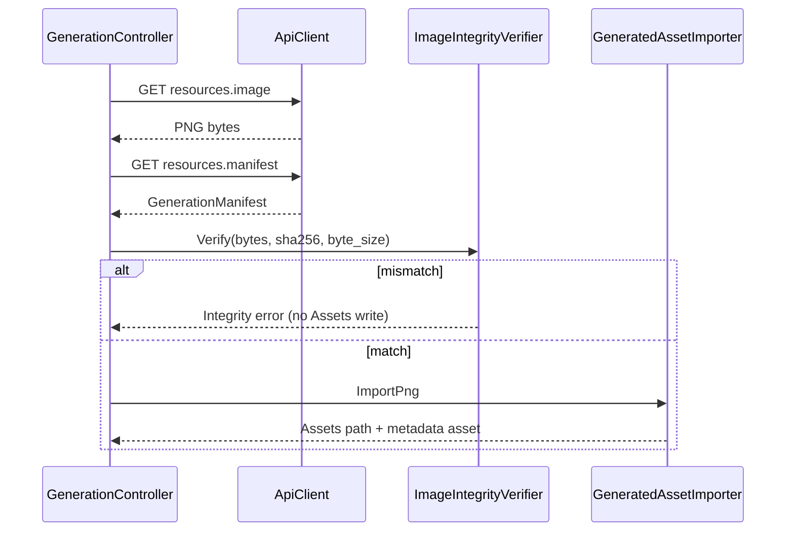

## Schema-version responsibilities

| Schema | Owner | Writer | Reader compatibility |
|--------|-------|--------|----------------------|
| Capabilities `1.x` | Backend `CapabilityService` | Capability endpoint | Unity major-match; ignore unknown optional fields |
| Model compatibility `1.x` | Backend `ModelService` | Install / revalidate | Major 1 applied to capability checks; newer major listed but ignored |
| Model metadata `1.x` | Backend `ModelService` | Install / revalidate | Unknown license stays `known: false` |
| Generation manifest `1.x` | Backend `OutputService` | New generations only | Unity major-match; legacy flat metadata converted on read |
| API `1.x` | Backend routes under `/api/v1` | All versioned endpoints | Unity supports API major `1` |

## Trust boundaries

- Backend binds to loopback by default
- Generation IDs are UUIDs only; no arbitrary path reads
- Capability endpoint is read-only and does not mutate model state
- Model deletion only affects paths inside configured storage roots
- Errors never include stack traces, tokens, cache paths, or absolute output paths as the primary contract
- Request IDs are sanitized against header injection

## Extending capabilities for future operations

1. Implement the operation in an inference backend
2. Report it via `describe_capabilities()` (accurate `supported` flags only)
3. Extend `OperationsCapabilities` / public schema with a new typed block
4. Keep unsupported operations as `{ "supported": false }`
5. Add policy constraints if the operation introduces new parameters
6. Bump capability schema **minor** for additive fields; **major** for breaking changes
7. Update fixtures, Unity models, validators, and docs together

## Milestone 11 model management

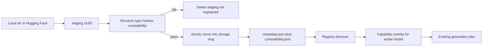

Install never registers a model until validation succeeds. Compatibility schema 1.x
restricts `operations.*.supported` through the existing family/backend capability path.
Offline mode blocks Hugging Face installs with `OFFLINE_OPERATION_UNAVAILABLE`.
Deletion requires `confirm=true` and refuses paths outside storage roots.

## Milestone 5 sprite/icon processing flow

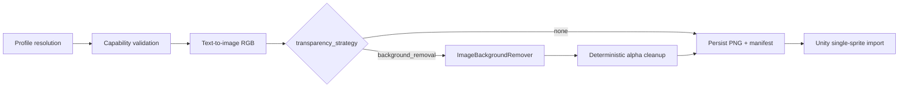

Diffusion models produce RGB. Transparent backgrounds are an explicit post-processing
strategy (`background_removal` via rembg/U2-Net), not native model alpha. Background
removal is optional, lazily loaded, reused across requests, and isolated behind
`ImageBackgroundRemover` so it never enters the diffusion backend protocol.

## Milestone 7 image-to-image variations

Img2img is a first-class generation **operation** (`image_to_image`), not a form of
reference-image conditioning. The uploaded `source_image` is the diffusion **init/latent
image**. Denoising strength controls how far the result may move from that init image.

Reference conditioning (IP-Adapter and similar) is intentionally absent. A future
`reference_image` / conditioning payload can be added beside `source_image` without
reusing img2img fields, labels, or pipeline entry points.

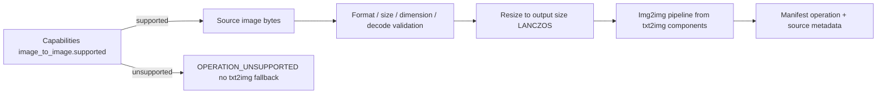

- API: extend `POST /api/v1/generations/textures` with `operation`, nested `source_image`
  (`content_base64`, optional `media_type`), and `denoising_strength`.
- Capabilities schema **1.3** advertises img2img ranges, supported source formats, and max
  upload size. SD 1.5 and SDXL families report `supported: true`; others report false.
- Manifest schema **1.4** records denoising strength and source-image metadata (not pixels).
- Diffusers converts the loaded txt2img pipeline with `AutoPipelineForImage2Image.from_pipe`
  so weights are shared. The fake backend blends the source with a seed color for tests.
- Unity: source picker + preview, denoising slider, preflight against capabilities, metadata
  `Operation = image_to_image`.

## Milestone 8 masks and inpainting

Inpainting is a first-class operation (`inpainting`), not a flag on img2img. The source image is
still the init image; the **mask** selects which pixels to regenerate. Convention:
**white = regenerate**, **black = keep**. Alpha on either image is ignored for mask semantics.

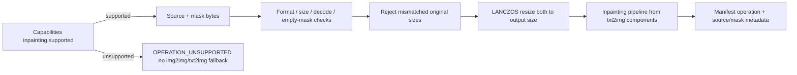

- API: `operation=inpainting`, nested `mask_image` (`content_base64`, optional `media_type`).
  `denoising_strength` is shared with img2img but `mask_image` is rejected on img2img requests.
- Capabilities schema **1.4** advertises inpainting ranges, mask formats, max upload size, and
  the `white_inpaints` convention. SD 1.5 and SDXL families report `supported: true`.
- Manifest schema **1.5** records `mask_convention` plus mask-image metadata (not pixels).
- Diffusers uses `AutoPipelineForInpainting.from_pipe` in `inference/inpainting.py` so weights
  are shared. The fake backend composites a seed-colored blend only where the mask is white.
- Unity: source + mask pickers, previews, red overlay, brush editor (white/black), clear/reset,
  preflight against capabilities, metadata `Operation = inpainting`.

Milestone 5 retains the common path through `GenerationController`: resolve a generation
profile, construct a wire DTO, validate capabilities, submit, download by `generation_id`,
verify, and record metadata. Asset-specific behavior begins after verification for Unity
import (sprite PPU/pivot/alpha settings). Icons reuse the sprite pipeline via profiles.

## Milestone 10 batch generation

A batch is an orchestration layer over Milestone 9 jobs, not a second queue or inference path.

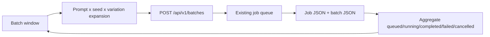

- Expansion is deterministic: sequential ranges use a stride so variations cannot collide
  with the requested seed range.
- Each expanded item is `JobService.submit(...)` with `batch_id` / indexes.
- Batch state is always recomputed from member jobs so Unity can recover after a window close
  or backend restart.
- Partial failure is a first-class `partial_success` state: completed results stay importable;
  failed jobs keep their errors and can be retried individually or via retry-failed.
- Unity imports through existing texture/sprite/icon profiles and records imported generation
  IDs so a UI refresh cannot reimport the same result.
