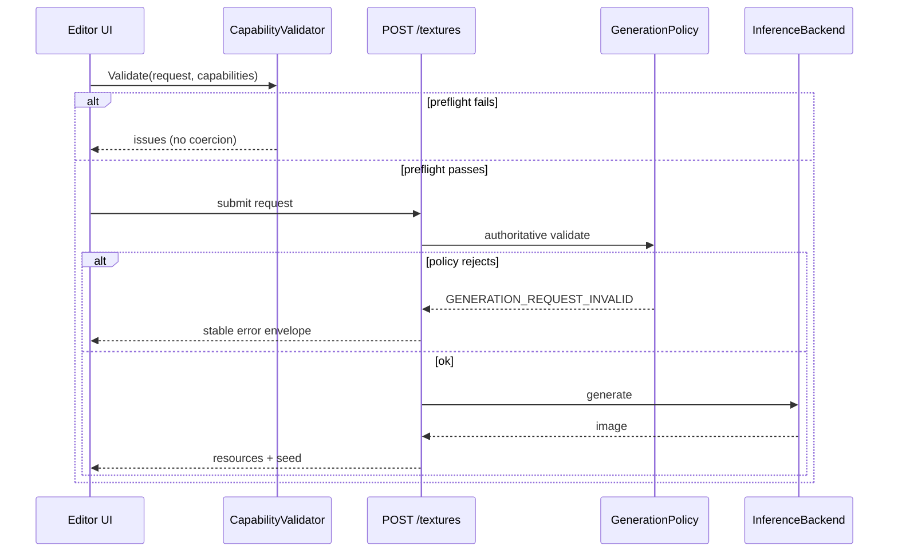
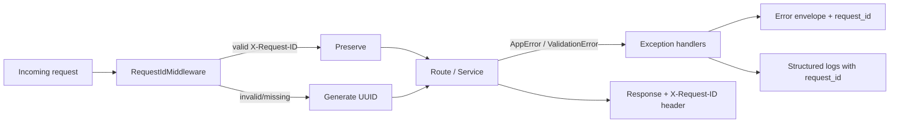
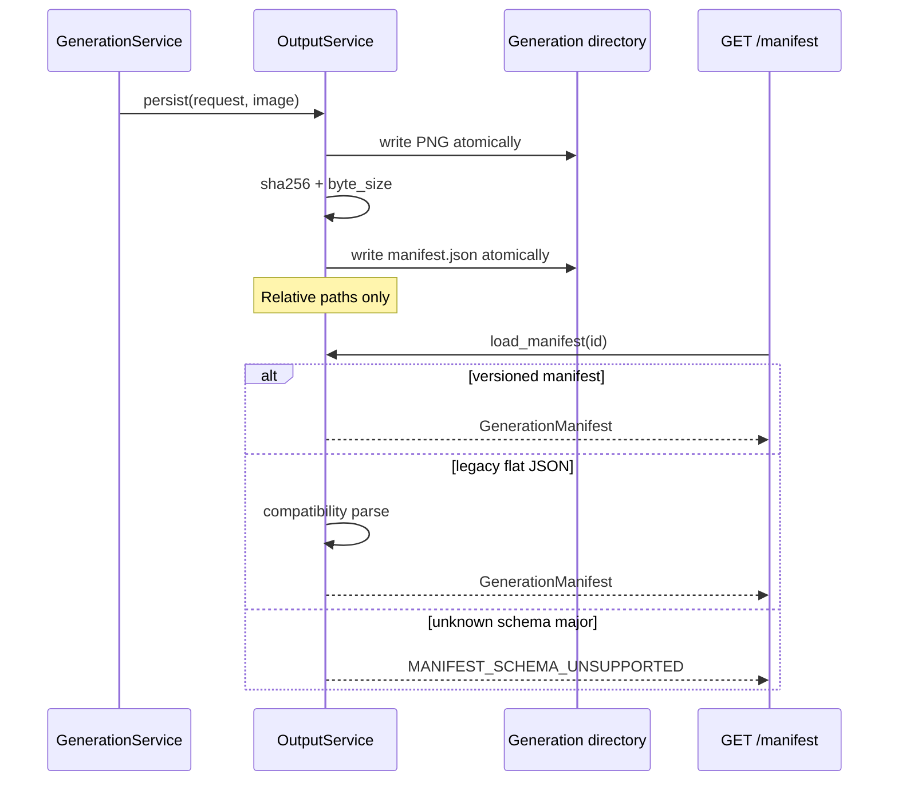
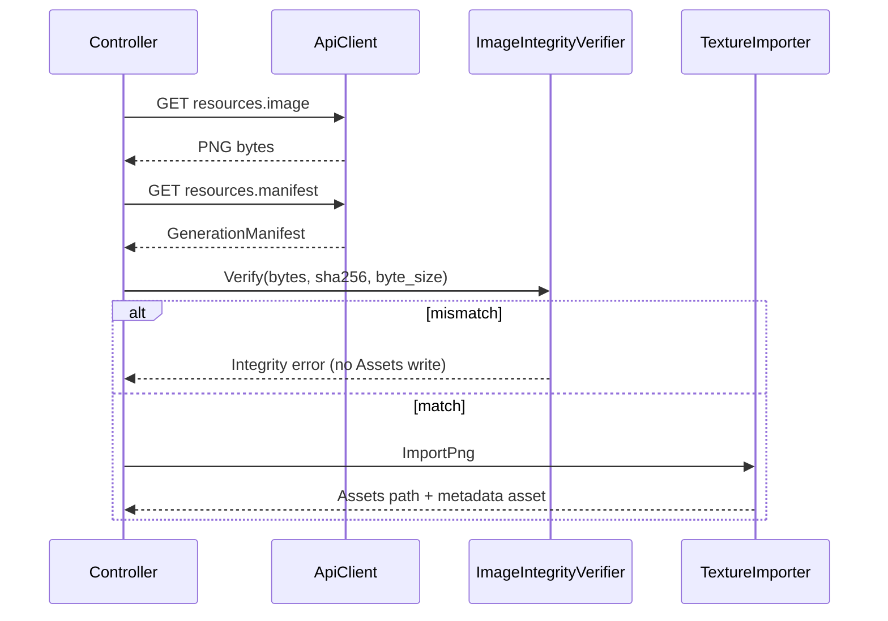

# Architecture

## Overview

Local FastAPI texture generation (Diffusers behind an inference protocol) plus an **editor-only Unity package** that discovers backend capabilities, downloads artifacts by generation ID, verifies integrity, and imports them into `Assets/`.

**ComfyUI is not used** in any form.

Application version: **0.3.0** (Milestone 3 — generation contract and capability reporting).

## Backend component responsibilities

| Layer | Responsibility |
|-------|----------------|
| `api/routes` | HTTP transport: health, capabilities, generation, image/manifest retrieval |
| `api/schemas` | Versioned public Pydantic models (capabilities, generation, errors) |
| `domain/generation_policy.py` | **Authoritative** generation limits and validation |
| `domain/capabilities.py` | Capability domain models |
| `domain/generation_manifest.py` | Manifest domain model + legacy metadata compatibility |
| `domain/generation.py` | Generation request/result dataclasses |
| `services/capability_service.py` | Assemble capability document from policy + inference |
| `services/generation_service.py` | Policy validation, seed, lock, orchestration |
| `services/output_service.py` | Atomic PNG + manifest persistence, SHA-256, resolve-by-UUID |
| `inference/*` | Backend protocol (`describe_capabilities` + `generate`), Diffusers, fake, model manager |
| `core/version.py` | Central API / schema / application version constants |
| `core/error_codes.py` | Stable application + field issue codes |
| `core/exception_handlers.py` | Translate AppError / Pydantic errors into the public envelope |
| `core/middleware.py` | `X-Request-ID` validation, generation, propagation |
| `core/config.py` | Settings including policy env vars; startup validation |

## Unity package components

| Area | Responsibility |
|------|----------------|
| `Editor/Api/` | Typed client, DTOs, SimpleJson, error envelope, endpoints |
| `Editor/Versioning/` | `SchemaVersion`, `ClientCompatibility` |
| `Editor/Capabilities/` | Cache, compatibility checker, preflight validator, state |
| `Editor/Integrity/` | PNG byte-size + SHA-256 verification |
| `Editor/Configuration/` | Project Settings |
| `Editor/Generation/` | Request model, state, controller orchestration |
| `Editor/Importing/` | Path utilities, import profiles, texture importer, materials |
| `Editor/Metadata/` | Manifest-aware ScriptableObject + importer |
| `Editor/UI/` | `Tools > AI Asset Generator` window |
| `Editor/Tests/` | Edit Mode tests (capabilities, errors, manifests, integrity) |

## Dependency direction

Unity never imports Diffusers types. Public schemas never expose Python class paths or absolute backend filesystem paths as the primary contract.

## Unity capability discovery

## Generation preflight and authoritative validation

## Error translation and request ID propagation

## Generation manifest creation and retrieval

## Unity image download and integrity verification

## Schema-version responsibilities

| Schema | Owner | Writer | Reader compatibility |
|--------|-------|--------|----------------------|
| Capabilities `1.x` | Backend `CapabilityService` | Capability endpoint | Unity major-match; ignore unknown optional fields |
| Generation manifest `1.x` | Backend `OutputService` | New generations only | Unity major-match; legacy flat metadata converted on read |
| API `1.x` | Backend routes under `/api/v1` | All versioned endpoints | Unity supports API major `1` |

## Trust boundaries

- Backend binds to loopback by default
- Generation IDs are UUIDs only; no arbitrary path reads
- Capability endpoint is read-only and does not mutate model state
- Errors never include stack traces, tokens, cache paths, or absolute output paths as the primary contract
- Request IDs are sanitized against header injection

## Extending capabilities for future operations

1. Implement the operation in an inference backend
2. Report it via `describe_capabilities()` (accurate `supported` flags only)
3. Extend `OperationsCapabilities` / public schema with a new typed block
4. Keep unsupported operations as `{ "supported": false }`
5. Add policy constraints if the operation introduces new parameters
6. Bump capability schema **minor** for additive fields; **major** for breaking changes
7. Update fixtures, Unity models, validators, and docs together
